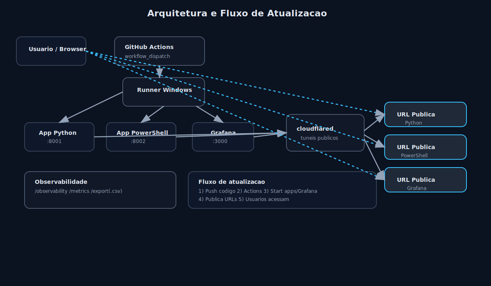

# teste-globo

Duas aplicacoes HTTP simples, cada uma em uma linguagem diferente:

- `app-python`: Python, cache de `10 segundos`
- `app-powershell`: PowerShell, cache de `60 segundos`

Tambem existe um proxy reverso local que centraliza o acesso em uma URL mais amigavel.

## Rotas das aplicacoes

As duas aplicacoes expoem:

- `GET /`: retorna o texto fixo `Ola Globo`
- `GET /time`: retorna o horario atual do servidor
- `GET /metrics`: retorna um JSON com metricas
- `GET /observability`: dashboard visual com metricas em tempo real
- `GET /export`: exporta o JSON de metricas
- `GET /export.csv`: exporta um CSV resumido

As respostas sao cacheadas em memoria dentro de cada aplicacao.

## Execucao local com um comando

```powershell
.\start-all.ps1
```

Esse comando sobe:

- a aplicacao Python na porta `8001`
- a aplicacao PowerShell na porta `8002`
- o proxy reverso na porta `8080` (opcional)

Links locais principais (com proxy):

- `http://localhost:8080/`
- `http://localhost:8080/python`
- `http://localhost:8080/python/time`
- `http://localhost:8080/powershell`
- `http://localhost:8080/powershell/time`

Se quiser rodar sem proxy:

```powershell
.\start-all.ps1 -SkipProxy
```

Para encerrar:

```powershell
.\stop-all.ps1
```

## Pipeline no GitHub Actions

Arquivo da workflow:

- `.github/workflows/publish-links.yml`

Como usar:

1. Abra a aba `Actions` no GitHub.
2. Execute a workflow `Publish Access Links`.
3. A pipeline vai subir as apps e publicar duas URLs publicas temporarias no resumo do job, uma para cada app.

A URL publica fica ativa enquanto o job estiver em execucao.

## URLs publicas separadas

O GitHub Actions, sozinho, nao hospeda uma URL publica permanente para suas aplicacoes.
Por isso a workflow cria dois tuneis publicos temporarios, um para cada app:

- Python: `https://.../` e `https://.../time`
- PowerShell: `https://.../` e `https://.../time`

## Grafana

A pipeline inicia o Grafana localmente no runner e publica um link publico temporario.
O Grafana fica acessivel enquanto o job estiver em execucao (padrao 60 minutos).
Para abrir o dashboard, faca login primeiro em `/grafana/login`.

Credenciais padrao:

- usuario: `admin`
- senha: `admin`

## Headers de apoio

Cada resposta inclui headers auxiliares:

- `X-Cache`: `MISS` ou `HIT`
- `X-Cache-TTL`: tempo de expiracao em segundos
- `X-Proxy`: indica o comportamento do proxy reverso

## Arquitetura (visual)


